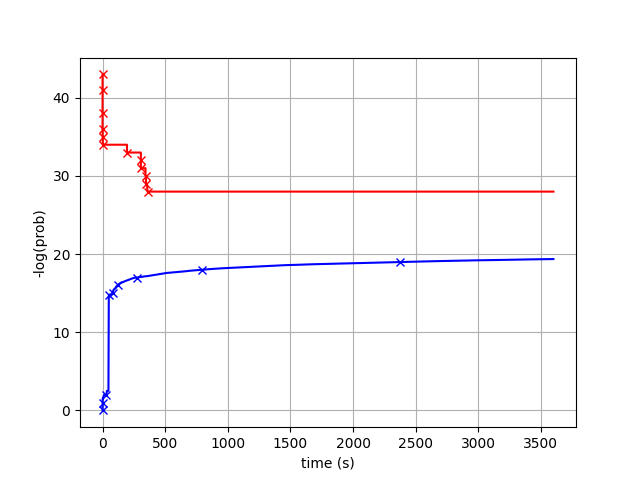

# Exact Probability Computations


## Theory verification

[verifyTheory.cpp](./verifyTheory.cpp) contains code for verifying theory from the paper. It can be run with

```
$ make verifyTheory && ./verifyTheory
```

Log of such execution is recorded in [verifyTheory.log](./verifyTheory.log).


## Alzette trail search

[runAlzette.cpp](./runAlzette.cpp) contains entry-point code for searching trails in Alzette. It can be run with 
```
$ make runAlzette
# ./runAlzette <constant_index> <rotation> <0:NEQ opt 1: full opt> <TL_NEQ> <TL_FULL>
# e.g. this will run search for c7, k=15, NEQ opt. for 1 hour and full opt. for 2 hours
$ ./runAlzette 7 15 0 3600 7200
$ ./runAlzette 7 15 1 3600 7200
```

The command `make runA1` would run search for all constant (in two parallel instances).

Trails are recorded in the folder [trails](./trails/). For example, [trails/alzette_constb7e15162_rotation1_fullopt_time14400.txt](./trails/alzette_constb7e15162_rotation1_fullopt_time14400.txt) contains the following:

```
Alzette_b7e15162_k1_nr4  # instance
32 1 2 0  # word size, rotation, num. state words, num key words
28 -33.660150  # NEQ, probability log2
5              # num states
085ff001 042df000  # state-based trail
d82003a7 07ddf000 
c803fc13 0007f810 
00200fa0 b000001f 
d803fc57 bff0003f 
0  # num key words
4  # num mod adds
085ff001 085be000 0003f000  # mod-add-based trail
d82003a7 f80003ee 10200fb4
c803fc13 0007f810 d803fc07
00200fa0 00001fb0 00200ff0
```

Search logs (including evolutions of the bounds) are in the folder [logs](./logs/) with the same filename format.

Figures with evolution are available in the [figures](./figures) folder, for example a NEQ bounds evolution example for k=3 and const `0x38b4da56` (1 hour):




## Alzette Trail Verification

Distinguisher verification logs are in the same folder with prefix `verify_` or `verifyMC_` (adding extra constants to quantify round dependency). The code is in [verifyAlzette.cpp](./verifyAlzette.cpp). It uses pseudorandomness so it can be reproduced: 

```
make verifyAlzette
make verifyA1
make verifyA2
```
contain all the parameters.

For example, the file [logs/verify_alzette_constb7e15162_rotation1_fullopt_time14400.txt](./logs/verify_alzette_constb7e15162_rotation1_fullopt_time14400.txt) contains:

```
===========================
Normal rounds testing
===========================
Testing Alzette_b7e15162_k1_nr4, using 2^42 data, seeds 0000000000000123 0000000000000456
Trail (state words):
  085ff001 042df000 
  d82003a7 07ddf000 
  c803fc13 0007f810 
  00200fa0 b000001f 
  d803fc57 bff0003f 
Found match #1 b74baef5:389a1968 (follows trail? 1)
...
Found match #107 fdc488c3:39fdd6bd (follows trail? 1)
Alzette_b7e15162_k1_nr4: 107/4398046511104 = 2^-35.26 experimental differential probability
Alzette_b7e15162_k1_nr4: 107/107/4398046511104 = 2^-35.26 experimental trail probability
```


## Verify Add-Constant formula

The code for verifying the add-constant formula is given in [verify_add_const.py](./verify_add_const.py) (requires `binteger` package):

```
$ pypy3 verify_add_const.py
```

Log of such execution is recorded in [verify_add_const.log](./verify_add_const.log).


## Searches for Speck, Salsa, ...

Other search codes are given in [main.cpp](./main.cpp). It has separate sections that have to be uncommented to run the corresponding search. Resulting logs are provided in [logs_other](./logs_other).
